# Kubernetes Installation on Ubuntu 22.04/24.04

## Anggota Tim

| No | Nama                             | NIM             | 
| -- | -------------------------------- | --------------- |  
| 1  | Zaqia Mahadewi                   | 235150201111001 | 
| 2  | Syafa Syakira Shalsabilla        | 235150201111006 | 
| 3  | Shafiyyah Daniswara Nurwijayanti | 245150207111061 |

Get the detailed information about the installation from the below-mentioned websites of **Docker** and **Kubernetes**.

[Docker](https://docs.docker.com/)

[Kubernetes](https://kubernetes.io/)

### Set up the Docker and Kubernetes repositories:

### Requirements
1. Ubuntu machines as Master and Worker ( build on VM using Bridge Adapter) minimal 2 machines: 1 Master and 1 Worker
2. Networking uses local network (FILKOM)


> Download the GPG key for docker

```bash
wget -O - https://download.docker.com/linux/ubuntu/gpg > ./docker.key

gpg --no-default-keyring --keyring ./docker.gpg --import ./docker.key

gpg --no-default-keyring --keyring ./docker.gpg --export > ./docker-archive-keyring.gpg

sudo mv ./docker-archive-keyring.gpg /etc/apt/trusted.gpg.d/
```
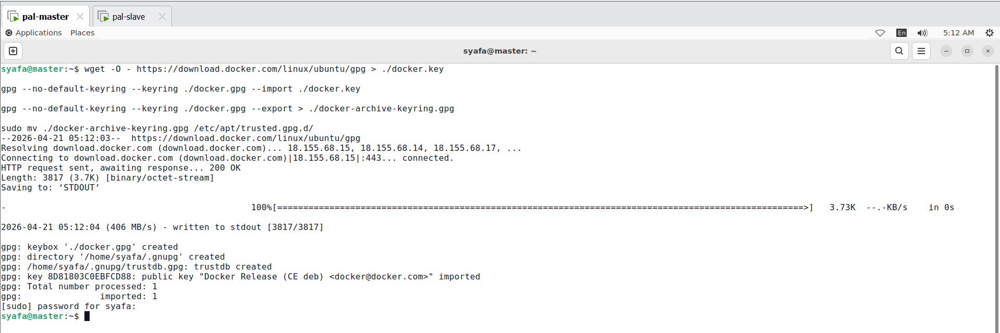
Persiapan diawali dengan penyediaan mesin berbasis Ubuntu yang difungsikan sebagai Master dan Worker melalui mesin virtual (VM). Konfigurasi jaringan pada VM diatur menggunakan Bridge Adapter agar setiap node terhubung langsung ke jaringan lokal (FILKOM). Untuk menjamin keamanan dan autentikasi paket yang akan diunduh, kunci GPG resmi untuk Docker diunduh dan ditambahkan ke dalam sistem. Selain itu, repositori Docker dan Kubernetes didaftarkan ke dalam daftar sumber paket sistem agar proses instalasi komponen pendukung dapat dilakukan dengan versi yang sesuai dan terverifikasi.

> Add the docker repository and install docker

```bash
# we can get the latest release versions from https://docs.docker.com

sudo add-apt-repository "deb [arch=amd64] https://download.docker.com/linux/ubuntu $(lsb_release -cs) stable" -y
sudo apt update -y
sudo apt install git wget curl socat -y
sudo apt install -y docker-ce

```
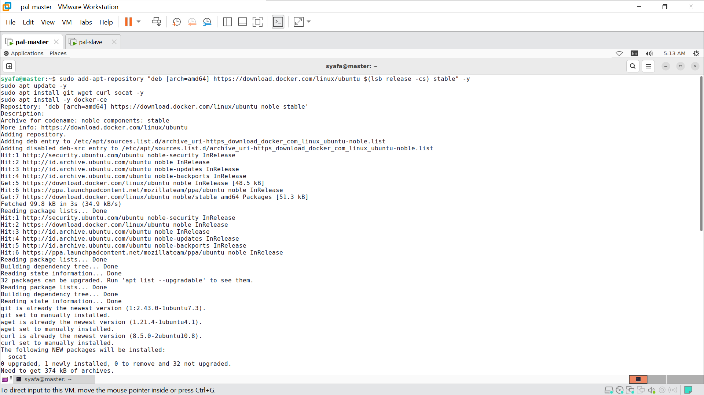
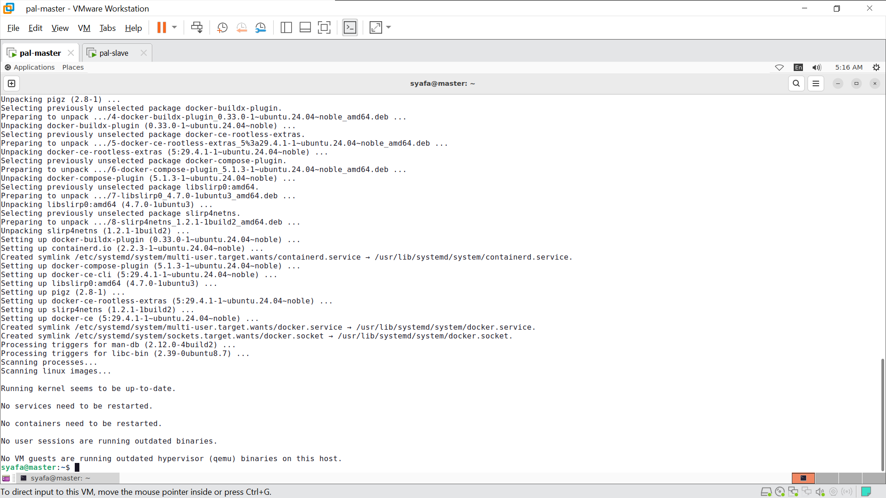
Setelah kunci GPG berhasil dikonfigurasi, repositori resmi Docker ditambahkan ke dalam sistem menggunakan perintah add-apt-repository dengan menyesuaikan arsitektur serta versi distribusi Ubuntu yang digunakan. Selanjutnya, daftar paket pada sistem diperbarui melalui perintah apt update untuk memastikan informasi dari repositori terbaru telah tersinkronisasi. Sebelum instalasi utama dilakukan, beberapa perangkat pendukung seperti git, wget, curl, dan socat dipasang terlebih dahulu untuk menjamin kelancaran proses operasional. Langkah ini diakhiri dengan pemasangan paket docker-ce (Docker Community Edition) ke dalam sistem sebagai mesin utama pengelola kontainer.

**To install cri-dockerd for Docker support**

**Docker Engine does not implement the CRI which is a requirement for a container runtime to work with Kubernetes. For that reason, an additional service cri-dockerd has to be installed. cri-dockerd is a project based on the legacy built-in Docker Engine support that was removed from the kubelet in version 1.24.**

> Get the version details

```bash
VER=$(curl -s https://api.github.com/repos/Mirantis/cri-dockerd/releases/latest|grep tag_name | cut -d '"' -f 4|sed 's/v//g')
```

> Run below commands

```bash

wget https://github.com/Mirantis/cri-dockerd/releases/download/v${VER}/cri-dockerd-${VER}.amd64.tgz

tar xzvf cri-dockerd-${VER}.amd64.tgz

sudo mv cri-dockerd/cri-dockerd /usr/local/bin/

wget https://raw.githubusercontent.com/Mirantis/cri-dockerd/master/packaging/systemd/cri-docker.service

wget https://raw.githubusercontent.com/Mirantis/cri-dockerd/master/packaging/systemd/cri-docker.socket

sudo mv cri-docker.socket cri-docker.service /etc/systemd/system/

sudo sed -i -e 's,/usr/bin/cri-dockerd,/usr/local/bin/cri-dockerd,' /etc/systemd/system/cri-docker.service

sudo systemctl daemon-reload
sudo systemctl enable cri-docker.service
sudo systemctl enable --now cri-docker.socket

```
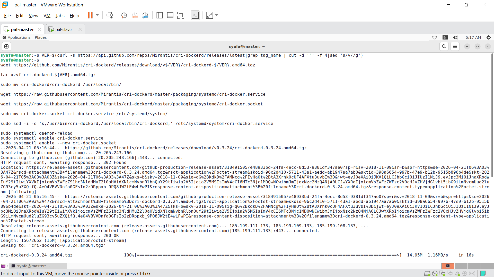
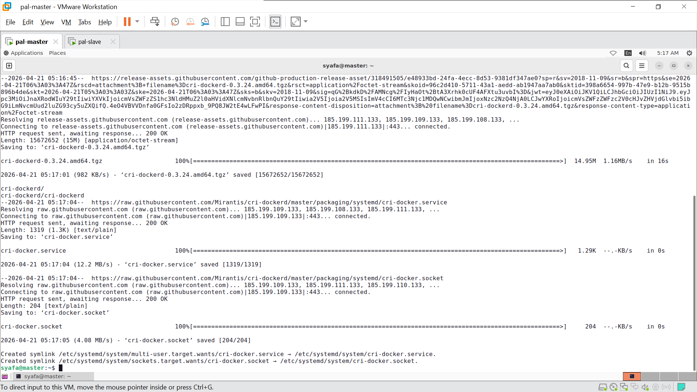
Dikarenakan Docker Engine tidak mengimplementasikan Container Runtime Interface (CRI) secara bawaan, maka paket tambahan cri-dockerd dipasang agar Docker dapat bekerja dengan Kubernetes. Proses ini dimulai dengan pengambilan informasi versi terbaru melalui API GitHub, yang kemudian dilanjutkan dengan pengunduhan berkas biner sesuai versi tersebut menggunakan wget. Setelah berkas berhasil diunduh, dilakukan ekstraksi dan pemindahan biner cri-dockerd ke dalam direktori /usr/local/bin/. Selain biner utama, berkas konfigurasi service dan socket untuk sistem unit systemd juga diunduh dan dipindahkan ke direktori sistem. Penyesuaian jalur eksekusi pada berkas konfigurasi dilakukan menggunakan perintah sed, lalu diakhiri dengan pemuatan ulang daemon serta pengaktifan layanan cri-docker agar dapat berjalan secara otomatis di dalam sistem.

> Add the GPG key for kubernetes

```bash
curl -fsSL https://pkgs.k8s.io/core:/stable:/v1.31/deb/Release.key | sudo gpg --dearmor -o /etc/apt/keyrings/kubernetes-apt-keyring.gpg
```

> Add the kubernetes repository

```bash
echo "deb [signed-by=/etc/apt/keyrings/kubernetes-apt-keyring.gpg] https://pkgs.k8s.io/core:/stable:/v1.31/deb/ /" | sudo tee /etc/apt/sources.list.d/kubernetes.list
```

> Update the repository

```bash
# Update the repositiries
sudo apt-get update
```

> Install  Kubernetes packages.

```bash
# Use the same versions to avoid issues with the installation.
sudo apt-get install -y kubelet kubeadm kubectl
```
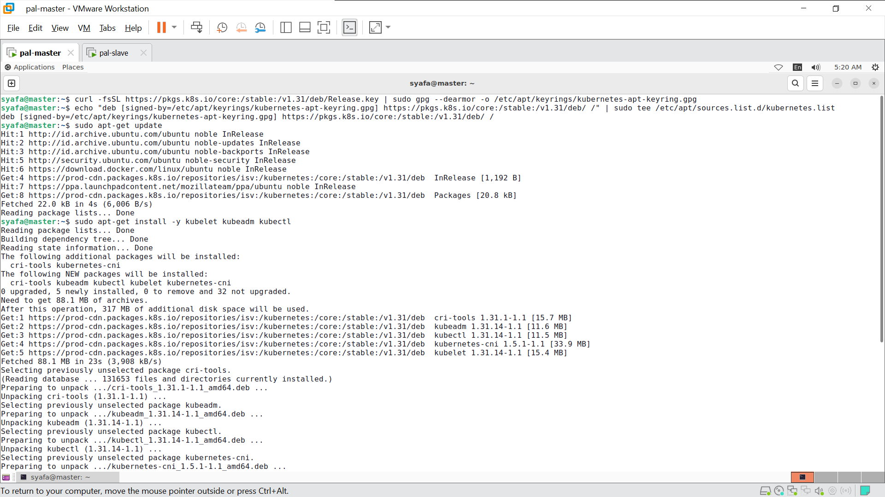
Tahap berikutnya difokuskan pada penyiapan repositori Kubernetes untuk memungkinkan pengunduhan komponen utama cluster. Kunci GPG resmi dari Kubernetes diunduh menggunakan curl dan dikonversi ke dalam format biner melalui perintah gpg --dearmor untuk disimpan di dalam gantungan kunci sistem. Setelah autentikasi tersebut siap, repositori Kubernetes versi 1.31 ditambahkan ke dalam daftar sumber paket sistem melalui pembuatan berkas konfigurasi di /etc/apt/sources.list.d/. Sinkronisasi ulang terhadap daftar paket kemudian dilakukan dengan perintah apt-get update agar sistem dapat mengenali repositori yang baru saja ditambahkan. Sebagai langkah akhir, tiga paket utama yaitu kubelet, kubeadm, dan kubectl dipasang secara bersamaan untuk memastikan seluruh alat pengelolaan cluster tersedia dalam versi yang konsisten.

> To hold the versions so that the versions will not get accidently upgraded.

```bash
sudo apt-mark hold docker-ce kubelet kubeadm kubectl
```

> Enable the iptables bridge

```bash
cat <<EOF | sudo tee /etc/modules-load.d/k8s.conf
overlay
br_netfilter
EOF

sudo modprobe overlay
sudo modprobe br_netfilter

# sysctl params required by setup, params persist across reboots
cat <<EOF | sudo tee /etc/sysctl.d/k8s.conf
net.bridge.bridge-nf-call-iptables  = 1
net.bridge.bridge-nf-call-ip6tables = 1
net.ipv4.ip_forward                 = 1
EOF

# Apply sysctl params without reboot
sudo sysctl --system
```
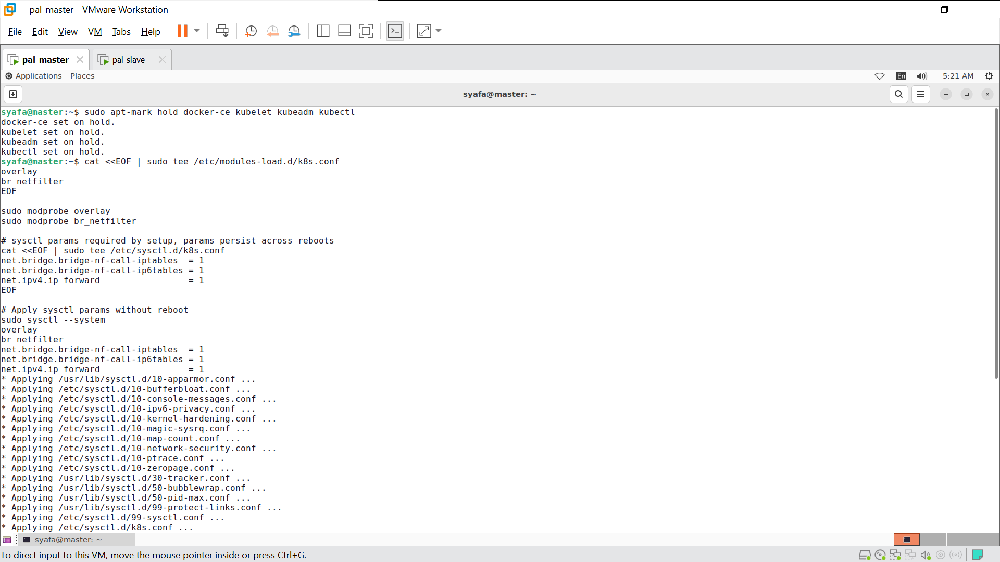
Agar stabilitas cluster terjaga, versi dari paket docker-ce, kubelet, kubeadm, dan kubectl dikunci menggunakan perintah apt-mark hold guna mencegah pembaruan otomatis yang tidak disengaja. Selanjutnya, konfigurasi jaringan pada kernel Linux diatur dengan mengaktifkan modul overlay dan br_netfilter melalui berkas konfigurasi di /etc/modules-load.d/. Hal ini dilakukan agar lalu lintas data antar-jembatan jaringan (bridge) dapat diproses oleh iptables. Parameter kernel tersebut kemudian diterapkan secara permanen melalui pembuatan berkas di /etc/sysctl.d/k8s.conf yang mencakup pengaturan bridge-nf-call-iptables dan ip_forward. Sebagai langkah terakhir, seluruh parameter sistem tersebut diaktifkan secara langsung tanpa memerlukan proses reboot melalui perintah sysctl --system.

### Disable SWAP
> Disable swap on controlplane and dataplane nodes

```bash
sudo swapoff -a
```

```bash
sudo vim /etc/fstab
# comment the line which starts with **swap.img**.
```
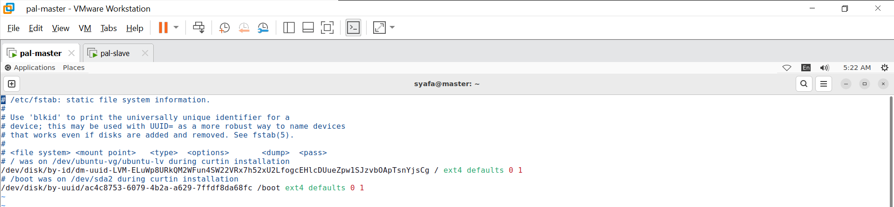
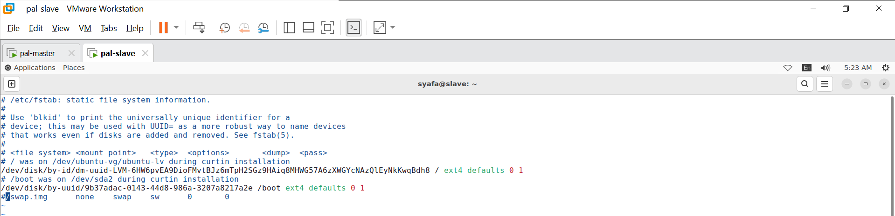
Langkah selanjutnya adalah penonaktifan fitur swap pada seluruh node, baik pada control plane maupun data plane. Hal ini dilakukan karena Kubernetes memerlukan stabilitas memori yang konsisten agar penjadwalan pod dapat berjalan secara akurat. Penonaktifan swap untuk sementara dilakukan melalui perintah swapoff -a. Agar perubahan tersebut bersifat permanen dan tidak aktif kembali saat sistem dinyalakan ulang, berkas konfigurasi /etc/fstab disunting menggunakan editor teks vim. Di dalam berkas tersebut, baris yang merujuk pada swap.img diberikan tanda komentar (simbol #) sehingga sistem tidak akan memuat partisi swap pada proses booting berikutnya.

### On the Control Plane server (Master node)

> Initialize the cluster by passing the cidr value and the value will depend on the type of network CLI you choose.

**Calico**

```bash
# Calico network
# Make sure to copy the join command
sudo kubeadm init --apiserver-advertise-address=<control_plane_ip> --cri-socket unix:///var/run/cri-dockerd.sock  --pod-network-cidr=192.168.0.0/16

# Or Use below command if the node network is not 192.168.x.x
sudo kubeadm init --apiserver-advertise-address=<control_plane_ip> --cri-socket unix:///var/run/cri-dockerd.sock  --pod-network-cidr=10.244.0.0/16

# Copy your join command and keep it safe.
# Below is a sample format
# Add --cri-socket /var/run/cri-dockerd.sock to the command
kubeadm join <control_plane_ip>:6443 --token 31rvbl.znk703hbelja7qbx --cri-socket unix:///var/run/cri-dockerd.sock --discovery-token-ca-cert-hash sha256:3dd5f401d1c86be4axxxxxxxxxx61ce965f5xxxxxxxxxxf16cb29a89b96c97dd
```
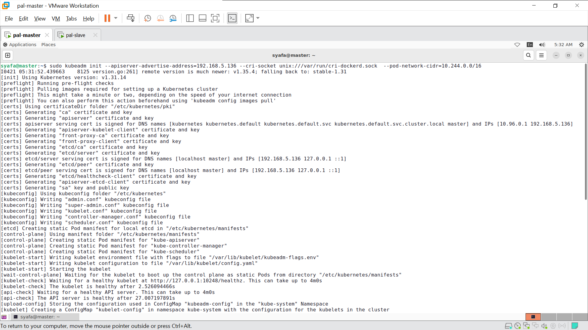
Proses pembentukan cluster dimulai pada node Control Plane (Master) dengan menjalankan perintah kubeadm init. Dalam tahap ini, alamat IP spesifik node master ditentukan sebagai titik akses API server, dan soket cri-dockerd didefinisikan secara eksplisit sebagai antarmuka runtime kontainer. Selain itu, rentang jaringan pod (CIDR) diatur sesuai dengan kebutuhan plugin jaringan yang akan digunakan. Selama proses inisialisasi berlangsung, berbagai sertifikat keamanan, kunci enkripsi, serta berkas konfigurasi administratif dibuat secara otomatis oleh sistem. Di akhir proses, sebuah perintah kubeadm join yang disertai dengan token unik dan hash sertifikat dihasilkan; perintah tersebut kemudian disimpan untuk digunakan pada tahap penggabungan node Worker ke dalam cluster.

> To start using the cluster with current user.

```bash
mkdir -p $HOME/.kube
sudo cp -i /etc/kubernetes/admin.conf $HOME/.kube/config
sudo chown $(id -u):$(id -g) $HOME/.kube/config
```
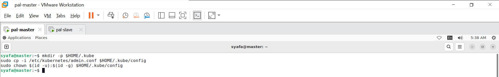
Setelah proses inisialisasi cluster selesai, konfigurasi hak akses diperlukan agar perintah kubectl dapat dijalankan oleh pengguna non-root. Hal ini diawali dengan pembuatan direktori .kube di dalam direktori beranda pengguna melalui perintah mkdir. Selanjutnya, berkas konfigurasi administratif admin.conf disalin dari direktori /etc/kubernetes/ ke dalam direktori .kube yang baru saja dibuat. Untuk memastikan pengguna memiliki hak akses penuh terhadap berkas tersebut, kepemilikan berkas diubah menggunakan perintah chown sesuai dengan identitas pengguna dan grup yang sedang aktif. Dengan selesainya langkah ini, pengelolaan cluster dapat dilakukan secara langsung melalui terminal tanpa memerlukan akses superuser (root).

> To set up the Calico network

```bash
# Use this if you have initialised the cluster with Calico network add on.
kubectl create -f https://raw.githubusercontent.com/projectcalico/calico/v3.28.2/manifests/tigera-operator.yaml

curl https://raw.githubusercontent.com/projectcalico/calico/v3.28.2/manifests/custom-resources.yaml -O

# Change the ip to 10.244.0.0/16 if the node network is 192.168.x.x
kubectl create -f custom-resources.yaml

```
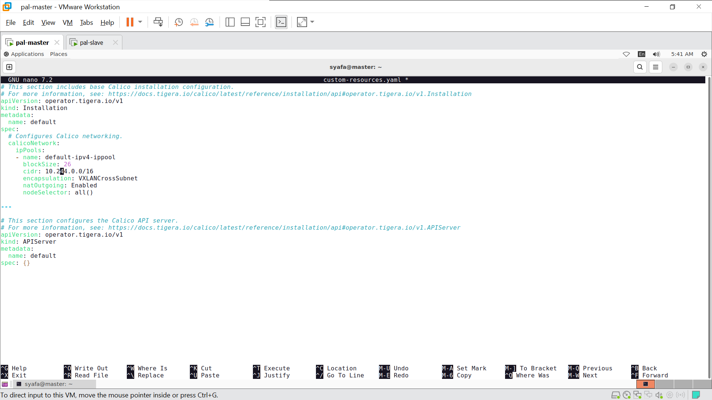
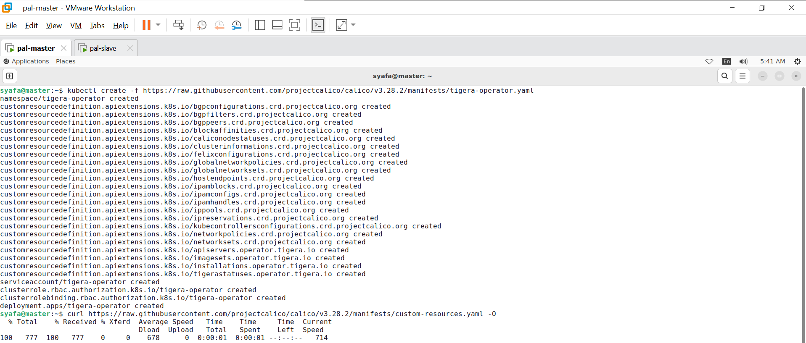
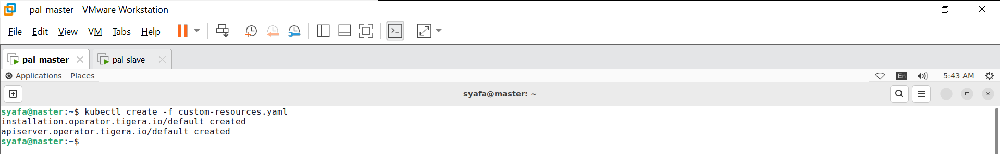
Pengaturan komunikasi antar-pod di dalam cluster dilakukan dengan menerapkan solusi jaringan Calico. Tahap ini diawali dengan pembuatan manifestasi tigera-operator melalui perintah kubectl create yang bersumber langsung dari repositori resmi Calico. Selanjutnya, berkas konfigurasi custom-resources.yaml diunduh menggunakan curl untuk mendefinisikan sumber daya kustom jaringan. Sebelum berkas tersebut diaplikasikan, penyesuaian alamat IP pada rentang jaringan pod dilakukan jika terdapat bentrokan dengan jaringan lokal node. Setelah konfigurasi dipastikan sesuai, berkas tersebut diterapkan ke dalam sistem agar seluruh komponen jaringan Calico dapat diinisialisasi dan dijalankan secara otomatis di dalam cluster.

> Check the nodes

```bash
# Check the status on the master node.
kubectl get nodes
```
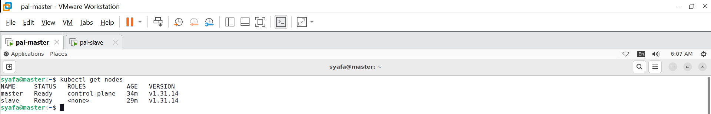
Setelah seluruh konfigurasi jaringan dan komponen utama berhasil diaplikasikan, pemeriksaan terhadap kondisi cluster dilakukan menggunakan perintah kubectl get nodes. Melalui langkah ini, daftar seluruh node yang terhubung, baik Master maupun Worker, ditampilkan beserta status operasionalnya masing-masing. Status "Ready" yang muncul pada kolom Status menunjukkan bahwa setiap node telah berhasil menginisialisasi runtime kontainer dan plugin jaringan dengan benar. Dengan tercapainya status tersebut, cluster dinyatakan telah siap sepenuhnya untuk menjalankan beban kerja dan penyebaran aplikasi (deployment).

### On each of Data plane node (Worker node)

> Joining the node to the cluster:

> Don't forget to include *--cri-socket unix:///var/run/cri-dockerd.sock* with the join command

```bash
sudo kubeadm join $controller_private_ip:6443 --token $token --discovery-token-ca-cert-hash $hash
#Ex:
# kubeadm join <control_plane_ip>:6443 --cri-socket unix:///var/run/cri-dockerd.sock --token 31rvbl.znk703hbelja7qbx --discovery-token-ca-cert-hash sha256:3dd5f401d1c86be4axxxxxxxxxx61ce965f5xxxxxxxxxxf16cb29a89b96c97dd
# sudo kubeadm join 10.34.7.115:6443 --cri-socket unix:///var/run/cri-dockerd.sock --token kwdszg.aze47y44h7j74x6t --discovery-token-ca-cert-hash sha256:3bd51b39b3a166a4ba5914fc3a19b61cfe81789965da6ac23435edb6aeed9e0d
```
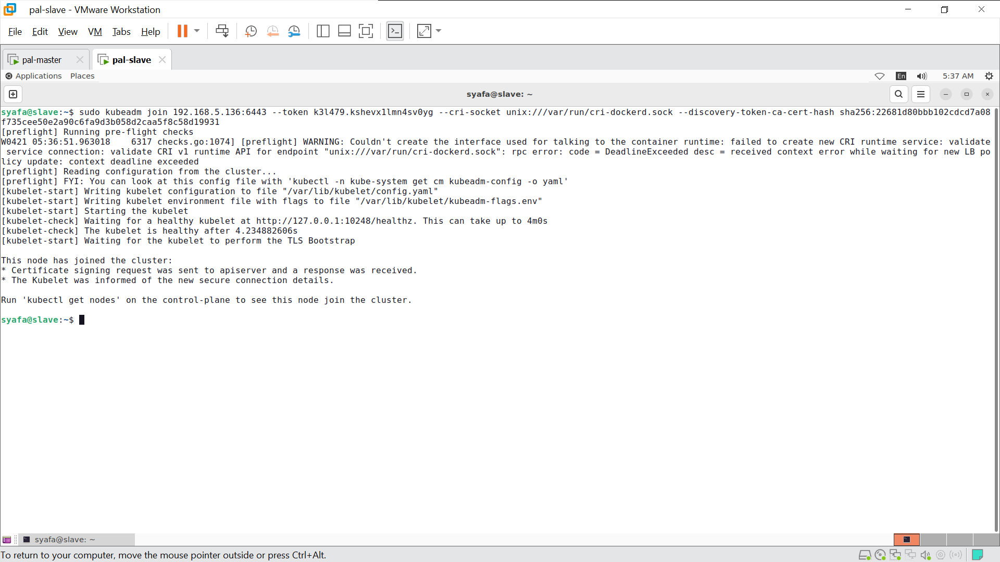
Setelah node Master berhasil dikonfigurasi, node Worker digabungkan ke dalam cluster menggunakan perintah kubeadm join. Dalam proses ini, alamat IP serta port dari API server node master ditentukan sebagai tujuan koneksi. Autentikasi keamanan dilakukan dengan menyertakan token unik dan hash sertifikat CA yang telah dihasilkan pada tahap inisialisasi master. Selain itu, soket cri-dockerd didefinisikan secara spesifik agar node worker dapat berkomunikasi dengan runtime kontainer secara benar. Segera setelah perintah tersebut dieksekusi dan proses jabat tangan (handshake) selesai, node worker akan terdaftar secara otomatis di dalam cluster dan siap untuk menerima penjadwalan beban kerja.

**TIP**

> If the joining code is lost, it can retrieve using below command

```bash
kubeadm token create --print-join-command
```

### To install metrics server (Master node)

```bash
git clone https://github.com/mialeevs/kubernetes_installation_docker.git
cd kubernetes_installation_docker/
kubectl apply -f metrics-server.yaml
cd
rm -rf kubernetes_installation_docker/
```
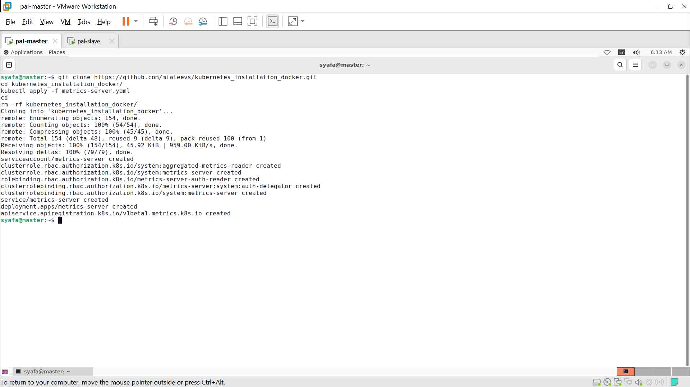
Apabila perintah penggabungan (join command) hilang atau kadaluwarsa, sebuah token baru dapat dibuat kembali melalui perintah kubeadm token create dengan menyertakan opsi untuk mencetak perintah penggabungan secara otomatis. Setelah seluruh node terhubung, komponen Metrics Server dipasang pada node master guna memungkinkan pemantauan penggunaan sumber daya di dalam cluster. Proses ini diawali dengan penggandaan repositori konfigurasi menggunakan git clone, yang kemudian dilanjutkan dengan penerapan manifestasi metrics-server.yaml ke dalam cluster melalui perintah kubectl apply. Sebagai langkah pembersihan, direktori repositori yang telah selesai digunakan dihapus dari sistem untuk menjaga kerapian direktori kerja.

### Installing Dashboard (Master node)

1. *Installing Helm:*
Download and install Helm with the following commands:
```bash
     curl -fsSL -o get_helm.sh https://raw.githubusercontent.com/helm/helm/main/scripts/get-helm-3
     chmod +x get_helm.sh
     ./get_helm.sh
     helm   
```
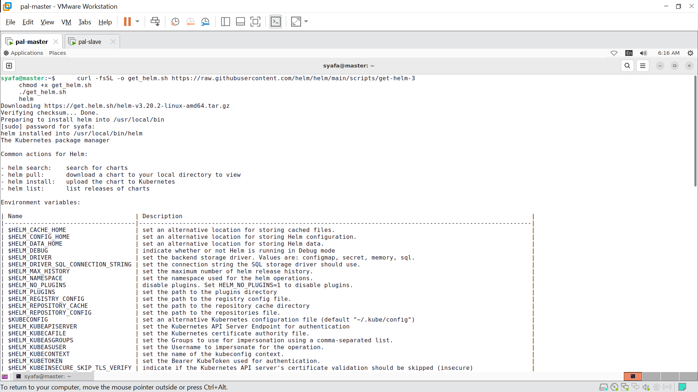
Tahap persiapan untuk instalasi dashboard diawali dengan pemasangan Helm sebagai manajer paket untuk Kubernetes. Proses ini dilakukan dengan mengunduh skrip instalasi resmi Helm melalui perintah curl. Setelah skrip berhasil diunduh, izin eksekusi diberikan kepada berkas tersebut menggunakan perintah chmod +x agar dapat dijalankan di dalam sistem. Skrip kemudian dieksekusi untuk memasang biner Helm versi terbaru ke dalam direktori sistem. Sebagai langkah terakhir, perintah helm dijalankan untuk memverifikasi bahwa aplikasi telah terpasang dengan benar dan siap digunakan untuk mengelola bagan (charts) di dalam cluster.

3. *Adding the Kubernetes Dashboard Helm Repository:*
Add the repository and verify it:
```bash   
     helm repo add kubernetes-dashboard https://kubernetes.github.io/dashboard/
     helm repo list    
```
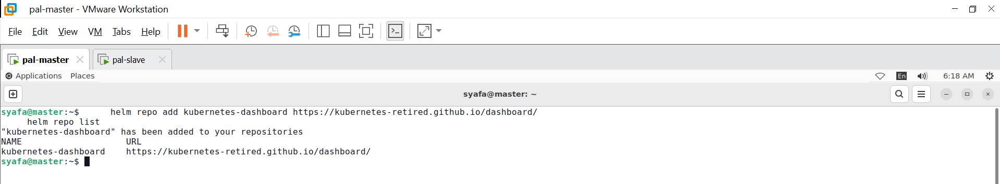
Setelah Helm terpasang, repositori resmi untuk Kubernetes Dashboard ditambahkan ke dalam daftar sumber Helm melalui perintah helm repo add. Pembaruan terhadap seluruh repositori Helm kemudian dilakukan untuk memastikan ketersediaan versi bagan (charts) terbaru. Selanjutnya, instalasi Dashboard dieksekusi menggunakan perintah helm upgrade --install ke dalam namespace khusus bernama kubernetes-dashboard. Selama proses ini, berbagai sumber daya seperti deployment, service, dan peran akses (roles) dibuat secara otomatis di dalam cluster. Sebagai langkah akhir, status deployment dipantau hingga seluruh pod terkait Dashboard dinyatakan aktif dan siap digunakan untuk manajemen cluster berbasis antarmuka grafis.

5. *Installing Kubernetes Dashboard Using Helm:*
Install it in the `kubernetes-dashboard` namespace:
```bash     
     helm upgrade --install kubernetes-dashboard kubernetes-dashboard/kubernetes-dashboard --create-namespace --namespace kubernetes-dashboard
     kubectl get pods,svc -n kubernetes-dashboard  
```
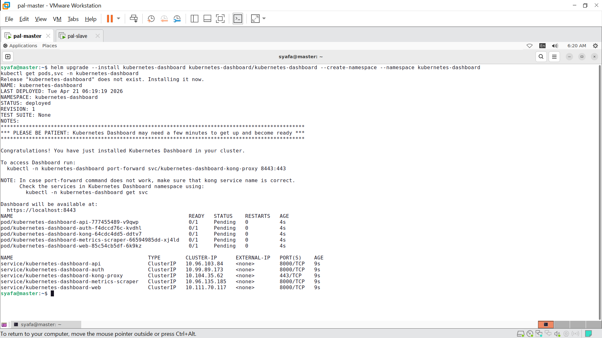
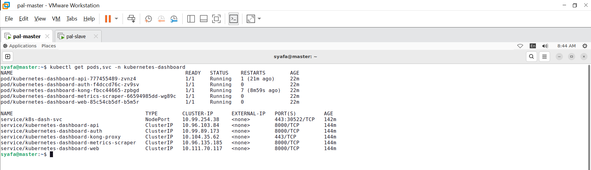
Instalasi Kubernetes Dashboard dilakukan dengan menggunakan perintah helm upgrade --install ke dalam namespace kubernetes-dashboard. Dalam proses ini, opsi --create-namespace disertakan agar sistem secara otomatis membuat ruang lingkup kerja baru jika belum tersedia. Setelah perintah eksekusi selesai, dilakukan pemantauan terhadap seluruh sumber daya yang telah dibuat melalui perintah kubectl get pods,svc. Melalui langkah ini, status operasional dari pod dan layanan (service) Dashboard dipastikan telah berjalan dengan benar di dalam namespace terkait. Kondisi seluruh komponen diverifikasi hingga mencapai status aktif, menandakan bahwa antarmuka grafis manajemen cluster telah siap untuk dikonfigurasi lebih lanjut.

7. *Accessing the Dashboard:*
Expose the dashboard using a NodePort:
```bash      
     kubectl expose deployment kubernetes-dashboard-kong --name k8s-dash-svc --type NodePort --port 443 --target-port 8443 -n kubernetes-dashboard
```
run: kubectl get pods,svc -n kubernetes-dashboard
use this port to access the dashboard from phy node IP: 
....
service/k8s-dash-svc                           NodePort    10.110.85.135   <none>        443:30346/TCP   23s


9. *Generating a Token for Login:*
Create a service account and generate a token:
```bash
   nano k8s-dash.yaml
```

```bash
apiVersion: v1
kind: ServiceAccount
metadata:
  name: widhi
  namespace: kube-system
---
apiVersion: rbac.authorization.k8s.io/v1
kind: ClusterRoleBinding
metadata:
  name: widhi-admin
roleRef:
  apiGroup: rbac.authorization.k8s.io
  kind: ClusterRole
  name: cluster-admin
subjects:
- kind: ServiceAccount
  name: widhi
  namespace: kube-system
```
then run:
```bash
kubectl apply -f k8s-dash.yaml
```
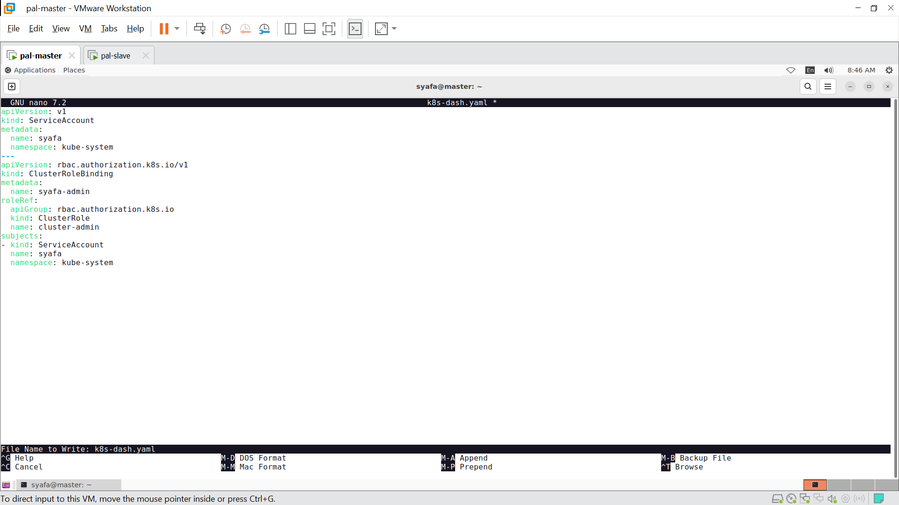
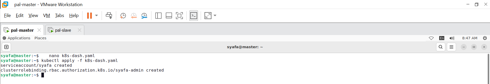
Agar Dashboard dapat diakses dari luar cluster, layanan kubernetes-dashboard-kong diekspos menggunakan tipe NodePort melalui perintah kubectl expose. Dengan langkah ini, sebuah port statis pada rentang 30000-32767 dibuka pada setiap node sehingga antarmuka grafis dapat diakses melalui alamat IP fisik node. Selanjutnya, sebuah akun layanan bernama widhi dibuat di dalam namespace kube-system untuk keperluan autentikasi login. Akun tersebut kemudian dihubungkan dengan peran cluster-admin melalui konfigurasi ClusterRoleBinding agar memiliki hak akses administratif penuh terhadap cluster. Seluruh konfigurasi tersebut didefinisikan di dalam berkas k8s-dash.yaml dan diaplikasikan ke dalam sistem menggunakan perintah kubectl apply. Sebagai langkah akhir, token akses dihasilkan dari akun layanan tersebut untuk digunakan sebagai kredensial masuk pada halaman Dashboard.

10. Generate the token:
```bash 
kubectl create token widhi -n kube-system
```
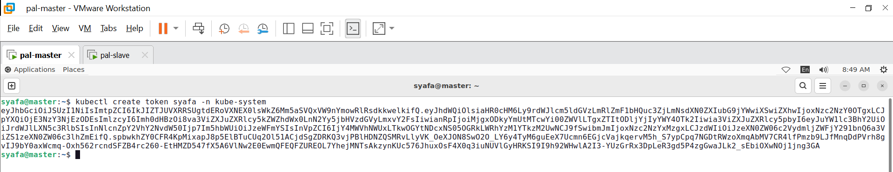
Setelah akun layanan dan pengaturan peran (role binding) berhasil diaplikasikan, token rahasia yang diperlukan untuk proses login Dashboard dihasilkan melalui perintah kubectl get secret. Token tersebut diambil dari akun layanan widhi yang berada di dalam namespace kube-system. Detail rahasia (secret) ditampilkan menggunakan perintah describe guna mendapatkan deretan kode token autentikasi yang panjang. Token tersebut kemudian disalin dan dimasukkan ke dalam kolom login pada antarmuka web Kubernetes Dashboard untuk mendapatkan akses administratif penuh ke dalam cluster.


